<div align="center">

[](https://diabetes-app-rmvw.onrender.com)
[](https://nodejs.org/)
[](https://expressjs.com/)
[](https://nodejs.org/)
[](#)
[](LICENSE)

**ဆီးချိုသမားတစ်ယောက်ရဲ့ နေ့စဉ် lifestyle ကို စီမံပေးတဲ့ web app**

*Daily lifestyle management for people living with diabetes — glucose, food, meds, activity, labs, doctor visits, all in one place.*

[🚀 Live Demo](https://diabetes-app-rmvw.onrender.com) ·
[✨ Features](#-features--လုပ်ဆောင်ချက်များ) ·
[⚡ Quick Start](#-quick-start) ·
[🔌 API](#-api-overview)

</div>


## ✨ Features · လုပ်ဆောင်ချက်များ

| | |
|---|---|
| 📊 **Dashboard** | နေ့စဉ်အကျဉ်းချုပ် cards, quick-log buttons, ၇ ရက်တာ glucose mini chart, သတိပေးချက်များ (ဆေးသောက်ချိန်, ဆေးကုန်ခါနီး, ဆရာဝန်ပြရက်) — *today summary, quick logging, reminders* |
| 🩸 **Glucose** | mg/dL ↔ mmol/L, နေ့စဉ်ဂရပ်, 7/14/30/90 ရက် trends, ပျမ်းမျှ/အနိမ့်/အမြင့်, target range နဲ့ time-in-range — *full glucose tracking with SVG charts* |
| 🍚 **အစားအသောက်** | မြန်မာအစားအစာ ၂၀ မျိုး + carb ခန့်မှန်း, ကိုယ်ပိုင်အစားအစာထည့်နိုင်, နေ့စဉ် carb စုစုပေါင်း — *Myanmar food database with carb estimates* |
| 💊 **ဆေးဝါး** | ဆေးစာရင်း, နေ့စဉ်သောက်ချိန်ဇယား, သောက်ပြီး/မသောက်မှတ်သား, လစဉ် adherence %, ဆေးကုန်ခါနီးသတိပေး — *schedules, adherence tracking, low-stock alerts* |
| 🏃 **လှုပ်ရှားမှု** | လေ့ကျင့်ခန်းမှတ်တမ်း, ခြေလှမ်းအရေအတွက်, ဖုန်း health app က CSV import, အပတ်စဉ်ဂရပ် — *exercise log, steps, CSV import* |
| ⚖️ **ကိုယ်အလေးချိန် + သွေးပေါင်** | မှတ်တမ်းနဲ့ trend ဂရပ်များ — *weight, blood pressure & pulse trends* |
| 🧪 **ဓာတ်ခွဲခန်းရလဒ်** | HbA1c trend အပါအဝင် — *lab results incl. HbA1c trend* |
| 👨‍⚕️ **ဆရာဝန်ပြရက်** | appointments, နောက်တစ်ခါပြရမယ့်ရက် သတိပေး, မေးချင်တဲ့မေးခွန်းစာရင်း — *appointments, questions, next-visit reminders* |
| 🖨️ **အစီရင်ခံစာ** | အပတ်စဉ်/လစဉ် အကျဉ်းချုပ် + print/PDF — *weekly/monthly reports, print-friendly* |
| 📚 **ပညာပေးဆောင်းပါး** | မြန်မာလို ဆောင်းပါး ၆ ပုဒ် — သွေးချိုကျခြင်း (hypoglycemia) အရေးပေါ်လုပ်ဆောင်ချက်အပါအဝင် — *6 genuine Burmese education articles* |
| ⚙️ **Settings** | မြန်မာ/English (မြန်မာ default), glucose units, target ranges, ဆီးချိုအမျိုးအစား, password ပြောင်း, CSV/JSON export, အကောင့်ဖျက် |
| 🔐 **Auth** | signup/login/logout — scrypt hashing, httpOnly + SameSite session cookies, user တစ်ယောက်ချင်းစီ ဒေတာခွဲခြား |


## ⚡ Quick Start

**Node.js 22+** လိုပါတယ် (`node:sqlite` အတွက်) — *requires Node.js 22+.*

```bash
git clone https://github.com/mymyanmarland/diabetes-app.git
cd diabetes-app
npm install
npm start        # http://localhost:3000
```

ပထမဆုံး run မှာ `data/app.db` အလိုအလျောက်ဆောက်ပေးတယ် — schema အပြည့် + မြန်မာအစားအစာ ၂၀ + ပညာပေးဆောင်းပါး ၆ ပုဒ် seed လုပ်ပြီးသား။
*On first run, the SQLite database is created automatically with the full schema, 20 Myanmar foods, and 6 Burmese education articles seeded.*

## 🛠️ Tech Stack

```
Node.js + Express          →  API + auth (scrypt, sessions)
node:sqlite                →  embedded database, zero-config
Vanilla JS SPA             →  no build step, no frameworks, no CDN
Inline SVG                 →  charts, zero dependencies
```

- Glucose ကို **mg/dL INTEGER** အနေနဲ့ သိမ်းတယ် — mmol/L က `mg/dL ÷ 18` နဲ့ ပြ။
- Timestamps အားလုံး UTC ISO — ပြတာက **Asia/Yangon**။
- No analytics, no tracking, no third-party requests — *သင့်ကျန်းမာရေးဒေတာ ဘယ်မှမပို့ဘူး။*

## 📁 Project Structure

```
diabetes-app/
├── server.js        # Express API + auth + sessions
├── db.js            # SQLite schema + seed data
├── public/
│   ├── index.html   # SPA shell
│   ├── app.js       # bilingual frontend (my/en)
│   └── styles.css   # teal health theme
├── assets/          # README artwork (animated SVG)
└── data/            # app.db (created on first run, git-ignored)
```

## 🔌 API Overview

| Method | Endpoint | |
|---|---|---|
| POST | `/api/auth/signup` · `/api/auth/login` · `/api/auth/logout` | Auth |
| GET/POST | `/api/glucose` · `/api/glucose/stats` | Glucose log + stats |
| GET/POST | `/api/foods/search` · `/api/food-logs` | Food diary |
| GET/POST/PUT | `/api/medications` · `/api/med-logs` | Meds + adherence |
| GET/POST | `/api/activities` · `/api/steps` | Activity + steps |
| GET/POST | `/api/weight` · `/api/bp` · `/api/labs` | Vitals + labs |
| GET/POST | `/api/appointments` | Doctor visits |
| GET | `/api/reports/weekly` · `/api/reports/monthly` | Reports |
| GET | `/api/articles` | Education articles |
| GET | `/api/export/csv` · `/api/export/json` | Data export |
| DELETE | `/api/auth/account` | Delete account |

*Every query is scoped to the logged-in user — no cross-user data leaks, verified by automated isolation tests.*

## 🔒 Security Notes

- Passwords: **scrypt** hashing (never stored plain)
- Sessions: httpOnly + SameSite cookies
- All inputs validated server-side; parameterized SQL only
- Rate-limited auth endpoints

## ⚠️ Disclaimer

ဒါက **ကိုယ်တိုင်မှတ်တမ်းတင်တဲ့ tool** သက်သက်ပါ — ရောဂါအမည်တပ်တာ, ဆေးညွှန်းတာ, ကုသမှုအကြံပေးတာ **မလုပ်ပါဘူး**။
ဆေးနဲ့ပတ်သက်တဲ့ ဆုံးဖြတ်ချက်တိုင်း ဆရာဝန်နဲ့တိုင်ပင်ပါ။

*This is a self-tracking tool only — no diagnosis, no prescriptions, no treatment advice. Always consult your doctor.*

## 🚀 Deployment

Live on **Render free** (Singapore): https://diabetes-app-rmvw.onrender.com

> Render free tier: service sleeps when idle (cold start ~30–60s), SQLite resets on redeploy.
> တကယ်သုံးမယ်ဆို PostgreSQL (သို့) persistent disk လိုပါတယ် — *needs Postgres/persistent disk before real use.*

---


<div align="center">

MIT License — လွတ်လပ်စွာသုံး၊ ပြင်၊ မျှဝေနိုင်

</div>
